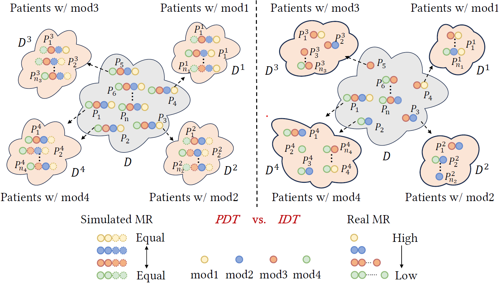
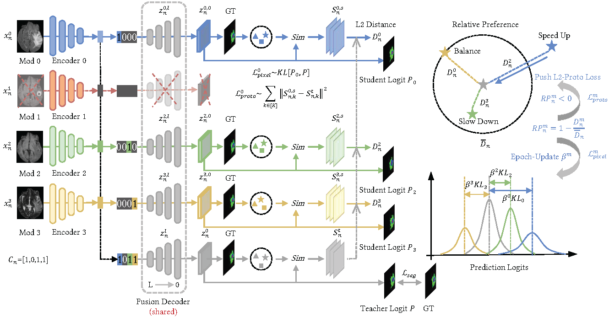

<div align="center">
<h1> 🔥PASSION [ACM MM'24 Oral]🎉 </h1>
<h3>PASSION:Towards Effective Incomplete Multi-Modal Medical Image Segmentation <br> with Imbalanced Missing Rates</h3>

[Junjie Shi](https://github.com/Jun-Jie-Shi)<sup>1</sup> ,[Caozhi Shang](https://github.com/Shangcz1015)<sup>1</sup> ,[Zhaobin Sun](https://github.com/szbonaldo)<sup>1</sup> ,[Li Yu](https://eic.hust.edu.cn/professor/yuli/)<sup>1</sup> ,[Xin Yang](https://sites.google.com/view/xinyang/home)<sup>1</sup> ,[Zengqiang Yan](https://mia2i.github.io/home/)<sup>1 :email:</sup>

🏢 <sup>1</sup> Huazhong University of Science and Technology,  (<sup>:email:</sup>) corresponding author.
<br> 🧐  [ArXivPreprint](https://arxiv.org/abs/2407.14796) | [OpenReview](https://openreview.net/forum?id=jttrL7wHLC)
</div>


## 📅News
* **` Jul. 25th, 2024`:** We made some refinements and optimizations to the code, including:
  * Unified the model implementation and the options of training settings;
  * Improved the part of multi-card and multi-batch parallel computation;
  * Fixed some bugs due to the late modification of models.
  * `Notes:` If you find our Figure. 2 in paper is garbled, try to switch the way you read it, e.g. Google Chrome, and we will change the figure from pdf to png format in the future.
* **` Jul. 21th, 2024`:** Our work is further selected as an Oral presentation (3.97% in total 4385 submissions), [OpenReview](https://openreview.net/forum?id=jttrL7wHLC) is open to public.
* **` Jul. 20th, 2024`:** We released our code and submitted our paper on [ArXiv](https://arxiv.org/abs/2407.14796).

## 👇Overview
<details>
  
### • Abstract
Incomplete multi-modal image segmentation is a fundamental task in medical imaging to refine deployment efficiency when only partial modalities are available. However, the common practice that complete-modality data is visible during model training is far from realistic, as modalities can have imbalanced missing rates in clinical scenarios. In this paper, we, for the first time, formulate such a challenging setting and propose Preference-Aware Self-diStillatION (PASSION) for incomplete multi-modal medical image segmentation under imbalanced missing rates. Specifically, we first construct pixel-wise and semantic-wise self-distillation to balance the optimization objective of each modality. Then, we define relative preference to evaluate the dominance of each modality during training, based on which to design task-wise and gradient-wise regularization to balance the convergence rates of different modalities. Experimental results on two publicly available multi-modal datasets demonstrate the superiority of PASSION against existing approaches for modality balancing. More importantly, PASSION is validated to work as a plug-and-play module for consistent performance improvement across different backbones.

<div align="center">

</div>

### • Framework
<div align="center">

</div>

</details>

## 📋️Requirements
We recommend using conda to setup the environment. See the `requirements.txt` for environment configuration.

All our experiments are implemented based on the PyTorch framework with one 24G NVIDIA Geforce RTX 3090 GPU, and we recommend installing the following package versions:
- python=3.8
- pytorch=1.12.1
- torchvision=0.13.1

Dependency packages can be installed using following command:

```bash
git clone https://github.com/Jun-Jie-Shi/PASSION.git
cd PASSION
conda create --name passion python=3.8
conda activate passion
pip install -r requirements.txt
```

## 📊Datasets Preparation
### Directly download preprocessed dataset
You can download the preprocessed dataset (e.g. BraTS2020) from [RFNet](https://drive.google.com/drive/folders/1AwLwGgEBQwesIDTlWpubbwqxxd8brt5A?usp=sharing) and unzip them in the `datasets/BraTS` folder.
```bash
  tar -xzf BRATS2020_Training_none_npy.tar.gz
```
The data-split is available in the `datasets/BraTS/BRATS2020_Training_none_npy` folder, and our imbalanced missing rates data-split is available in the `datasets/BraTS/brats_split` folder.

### How to preprocess by yourself
If you want to preprocess by yourself, the preprocessing code `code/preprocessing/preprocess_brats.py` is also provided, just download `BRATS2020_Training_Data` in `datasets/BraTS` folder. (Here `BRATS2020_Training_Data` may refer to `BRATS2020_Training_Data/MICCAI_BRATS2020_Training_Data` in you download in [kaggle](https://www.kaggle.com/datasets/awsaf49/brats20-dataset-training-validation).)

And if you want to divide data by yourself, `data_split.py` and `generate_imb_mr.py` in the `code/preprocessing` folder is available. (Here we only provide the preprocessing for BraTS, if you want to use other datasets, just do it similarly)

If your folder structure (especially for datasets path) is as follows:
```
PASSION/
├── datasets
│   ├── BraTS
│   │   ├── BRATS2020_Training_Data
│   │   │   ├── BraTS20_Training_001
│   │   │   │   ├── BraTS20_Training_001_flair.nii.gz
│   │   │   │   ├── BraTS20_Training_001_seg.nii.gz
│   │   │   │   ├── BraTS20_Training_001_t1.nii.gz
│   │   │   │   ├── BraTS20_Training_001_t1ce.nii.gz
│   │   │   │   ├── BraTS20_Training_001_t2.nii.gz
│   │   │   ├── BraTS20_Training_002
│   │   │   │   ├── ...
│   │   │   ├── ...
│   │   │   ├── BraTS20_Training_369
│   │   │   │   ├── ...
├── code
│   ├── ...
└── ...
```
you can simply conduct the preprocessing as following:
``` python
python code/preprocessing/preprocess_brats.py
python code/preprocessing/data_split.py
python code/preprocessing/generate_imb_mr.py
```
After preprocessing, your folder structure is assumed to be:
```
PASSION/
├── datasets
│   ├── BraTS
│   │   ├── BRATS2020_Training_Data
│   │   │   ├── ...
│   │   ├── BRATS2020_Training_none_npy
│   │   │   ├── seg
│   │   │   ├── vol
│   │   │   ├── test.txt
│   │   │   ├── train.txt
│   │   │   ├── val.txt
│   │   ├── brats_split
│   │   │   ├── Brats2020_imb_split_mr2468.csv
├── code
│   ├── ...
└── ...
```

## 🔧Options Setting
Before start training, you should check the options in `code/options.py`,  especially for datasets path. Our code-notes may help you.

Our default relative datapath is according to our folder structure, if your datapath is different, just change `datarootPath` and `datasetPath` as your absolute data-saving root-path and dataset-saving path. 

Other path setting like `imbmrpath` and `savepath` is also noteworthy.

## 🚀Running
You can conduct the experiment as following if everything is ready.
```
cd ./code
python train.py --use_passion
```

For evaluation, the `eval.py` is simply implemented, just change the corresponding checkpoint path `resume` and other path settings.

Some bash scripts in `code/scripts` folder may be useful.

## 📑Acknowledgement
The implementation is based on the repos: [RFNet](https://github.com/dyh127/RFNet), [mmFormer](https://github.com/YaoZhang93/mmFormer), [RedCore](https://github.com/sunjunaimer/RedCore), we'd like to express our gratitude to these open-source works.

## ✨Citation
If you find PASSION is useful in your research or applications, welcome to cite our paper and give us a star 🌟.
```bibtex
 @article{passion,
  title={PASSION: Towards Effective Incomplete Multi-Modal Medical Image Segmentation with Imbalanced Missing Rates},
  author={Junjie Shi and Caozhi Shang and Zhaobin Sun and Li Yu and Xin Yang and Zengqiang Yan},
  journal={arXiv preprint arXiv:2407.14796},
  year={2024}
}
```

## 📧Contact
If you have any other questions, feel free to contact 'shijunjie@hust.edu.cn'.
