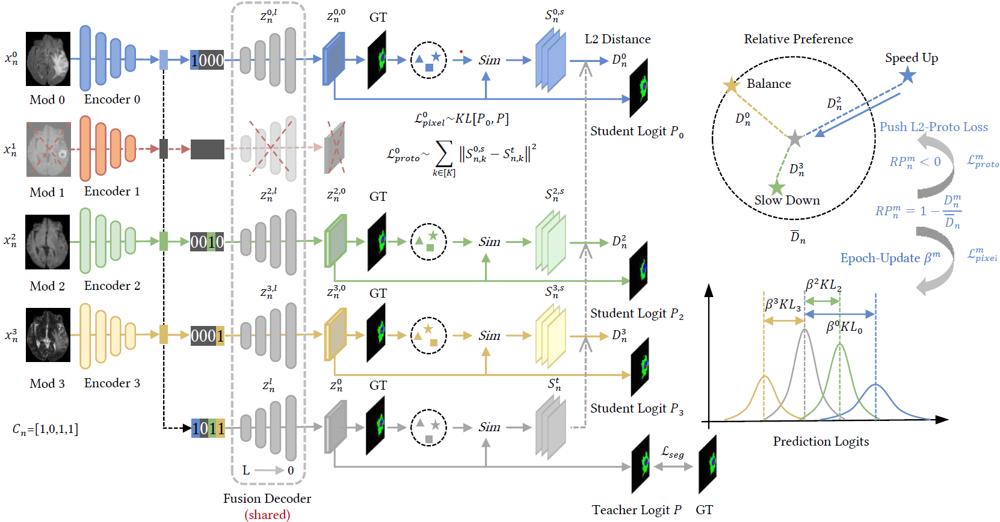

<div align="center">
<h1> PASSION [ACM MM'24]🎉 </h1>
<h3>PASSION:Towards Effective Incomplete Multi-Modal Medical Image Segmentation <br> with Imbalanced Missing Rates</h3>

[Junjie Shi](https://github.com/Jun-Jie-Shi)<sup>1</sup> ,[Caozhi Shang](https://github.com/Shangcz1015)<sup>1</sup> ,[Zhaobin Sun](https://github.com/szbonaldo)<sup>1</sup> ,[Li Yu](https://eic.hust.edu.cn/professor/yuli/)<sup>1</sup> ,[Xin Yang](https://sites.google.com/view/xinyang/home)<sup>1</sup> ,[Zengqiang Yan](https://mia2i.github.io/home/)<sup>1 :email:</sup>

<sup>1</sup>  Huazhong University of Science and Technology, (<sup>:email:</sup>) corresponding author.
<br> ArXiv Preprint ()
</div>

## Abstract
Incomplete multi-modal image segmentation is a fundamental task in medical imaging to refine deployment efficiency when only partial modalities are available. However, the common practice that complete-modality data is visible during model training is far from realistic, as modalities can have imbalanced missing rates in clinical scenarios. In this paper, we, for the first time, formulate such a challenging setting and propose Preference-Aware Self-diStillatION (PASSION) for incomplete multi-modal medical image segmentation under imbalanced missing rates. Specifically, we first construct pixel-wise and semantic-wise self-distillation to balance the optimization objective of each modality. Then, we define relative preference to evaluate the dominance of each modality during training, based on which to design task-wise and gradient-wise regularization to balance the convergence rates of different modalities. Experimental results on two publicly available multi-modal datasets demonstrate the superiority of PASSION against existing approaches for modality balancing. More importantly, PASSION is validated to work as a plug-and-play module for consistent performance improvement across different backbones.

<div align="center">

</div>

## Overview
<div align="center">

</div>

## Requirements
We recommend using conda to setup the environment. See the `requirements.txt` for environment configuration.

All our experiments are implemented based on the PyTorch framework with one 24G NVIDIA Geforce RTX 3090 GPU, and we recommend installing the following package versions:
- python=3.8
- pytorch=1.12.1
- torchvision=0.13.1

Dependency packages can be installed using following command:

```bash
conda create --name passion python=3.8
conda activate passion
pip install -r requirements.txt
```

## Datasets Preparation
You can download the preprocessed dataset (like BraTS2020) from [RFNet](https://drive.google.com/drive/folders/1AwLwGgEBQwesIDTlWpubbwqxxd8brt5A?usp=sharing) and unzip them in the `datasets/BraTS` folder.
```bash
  tar -xzf BRATS2020_Training_none_npy.tar.gz
```
The data-split is available in the `datasets/BraTS/BRATS2020_Training_none_npy` folder, and our imbalanced missing rates data-split is available in the `datasets/BraTS/brats_split` folder.

If you want to preprocess by yourself, the preprocessing code `code/preprocessing/preprocess_brats.py` is also provided, just download BRATS2020 in `datasets/BraTS/BRATS2020_Training_Data` folder.

And if you want to divide data by yourself, `data_split.py` and `generate_imb_mr.py` in the `code/preprocessing` folder is available. (Here we only provide the preprocessing for BraTS, if you want to use other datasets, just do it similarly)

If your folder structure (especially for datasets path) is as follows:
```
PASSION/
├── datasets
│   ├── BraTS
│   │   ├── BRATS2020_Training_Data
│   │   │   ├── ...
├── code
│   ├── ...
└── ...
```
you can simply conduct the preprocessing as following:
```
python code/preprocessing/preprocess_brats.py

```
